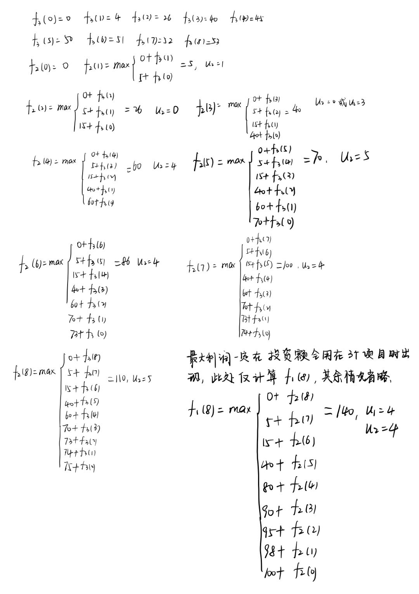

# SY2221110 田震 Assignment_1

### 一、用动态规划方法手工求解问题

问题分为三个阶段，第$k$个阶段是确定项目$k$的投资额.

设状态变量$x_k$表示用于项目$k$到项目3的投资额

决策变量$u_k$表示分配给项目$k$的投资额。则状态转移方程：$x_{k+1} = x_k - u_k$, 允许决策集合$D_k(x_k) = \left\{u_k|0 \le u_k \le x_k\right\}$

$f_k(x_k)$表示将投资额$x_k$用于投资项目$k$至项目3所得到的最大利润, $g_k(u_k)$表示给项目$k$投入$u_k$投资额时的盈利，具体可由题中表格得到。

则递推关系式：$\begin{cases}f_k(x_k) = \max \limits_{0\le u_k \le x_k}\left\{g_k(u_k) + f_{k+1}(x_k - u_k)\right\} & k=2,1 \\ f_3(x_3) = g_3(x_3)\end{cases}$

手工求解详细步骤如下：

在项目1投资4万元、项目2投资4万元时利润最大，为140万元。

### 二、 用动态规划方法编程求解下面的题目

